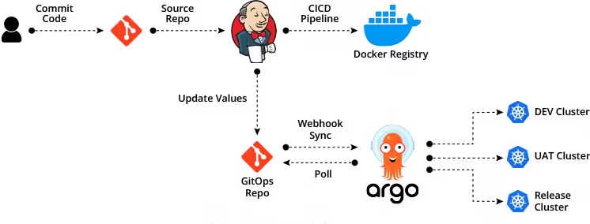

# Question 05: 

Secure CI/CD Architecture for Microservices Using GitOps

## Problem Statement

Microservices developed in different languages require a secure and scalable CI/CD pipeline to ensure seamless deployment. While Kubernetes is a common orchestrated environment, some applications may still rely on virtual machines (VMs) for deployment. The challenge is to design a CI/CD architecture that supports both scenarios while ensuring security, automation, and consistency.

## Solution

**GitOps** serves as the backbone for CI/CD by using Git as the single source of truth for deployment configurations. This approach can be tailored for both Kubernetes and VM-based deployments.

# 🏠 Architecture




### Key Components of the Architecture

1. **Git Repositories**:
   - **Source Code Repos**: Each microservice has its own repository for application code.
   - **Infrastructure Repos**: Separate repositories store configurations (e.g., Kubernetes manifests or VM-specific deployment scripts).

2. **CI Pipeline**:
   - Build and test microservices.
   - Containerize applications using Docker or create platform-specific artifacts (e.g., JAR files, binaries).
   - Push artifacts to a secure registry (e.g., Docker Hub, AWS ECR) or artifact repository (e.g., Nexus, Artifactory).

3. **CD Pipeline**:
   - **For Kubernetes**: Use GitOps tools like ArgoCD or FluxCD to sync changes from Git to the cluster.
   - **For VMs**: Use infrastructure automation tools like Ansible, Chef, or Terraform to deploy services on VMs.

4. **Security Considerations**:
   - Secure artifact storage using role-based access control (RBAC).
   - Use TLS for secure communication between CI/CD tools and deployment targets.
   - Centralize secrets management with tools like HashiCorp Vault or AWS Secrets Manager.

---

### Architecture Diagram

#### Kubernetes-Based Deployment
```plaintext
    +----------------+          +-------------------+          +-----------------+
    |  Devs Commit   |          | CI Pipeline       |          | Container       |
    |  Source Code   |          | (GitHub Actions,  |          | Registry        |
    |  (Git Repo)    +----------> GitLab CI, Jenkins) +---------> (ECR, Harbor)  |
    +----------------+          +-------------------+          +-----------------+
            |
            | Push Kubernetes Manifests
            v
    +-------------------+
    | Infrastructure    |
    | Git Repo (Manifests|
    +-------------------+
            |
            | Sync via GitOps Tool
            v
    +-------------------+
    | CD Pipeline       |
    | (ArgoCD, FluxCD)  |
    +-------------------+
            |
            | Apply Manifests
            v
    +-----------------------+
    | Kubernetes Cluster    |
    | (20 Microservices)    |
    +-----------------------+
```
### Architecture Diagram

#### Vm or Docker-Based Deployment


    +----------------+          +-------------------+          +----------------+
    |  Devs Commit   |          | CI Pipeline       |          | Artifact Repo  |
    |  Source Code   |          | (GitHub Actions,  |          | (Nexus, S3)   |
    |  (Git Repo)    +----------> GitLab CI, Jenkins) +--------->              |
    +----------------+          +-------------------+          +----------------+
            |
            | Push Deployment Scripts
            v
    +-------------------+
    | Infrastructure    |
    | Git Repo (Scripts)|
    +-------------------+
            |
            | Execute Scripts
            v
    +-----------------------+
    | CD Pipeline (Ansible) |
    +-----------------------+
            |
            | Deploy to VMs
            v
    +-----------------------+
    | Virtual Machines      |
    | (20 Microservices)    |
    +-----------------------+
